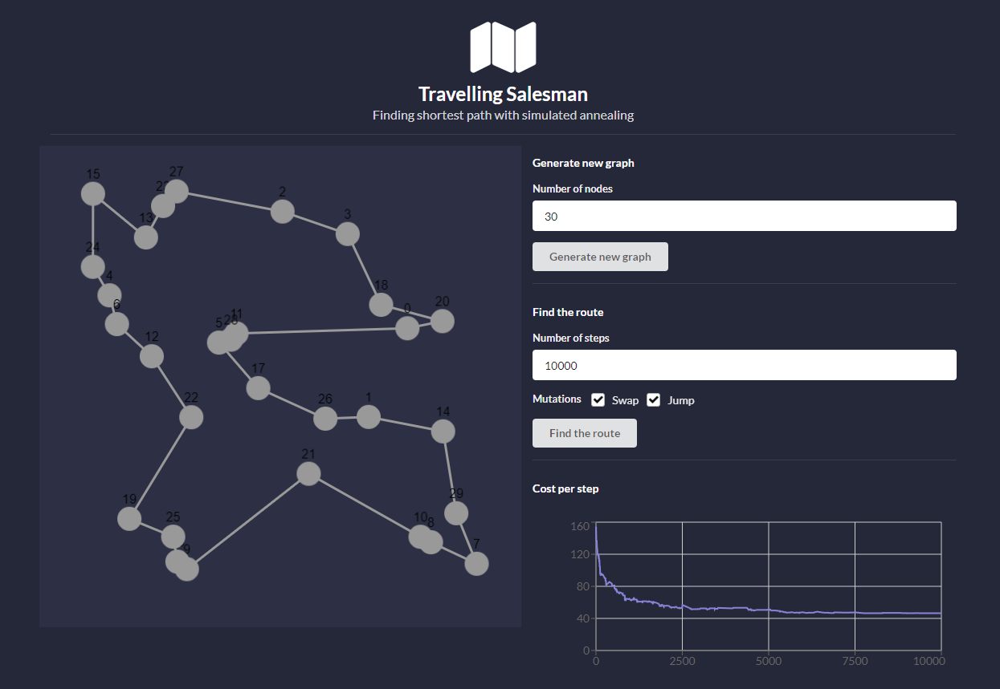

# Travelling Salesman with Simulated Annealing

A simple web application with backend solving the travelling salesman problem with simulated annealing, and a visualisation layer. Test out different mutation strategies, visualise the solution, and see the progress of the solver.

## Running the solution locally

### Install the dependencies

1. Backend

Backend is implemented in Python and all the dependencies are listed in `api/requirements.txt`. You can create a virtual environment:
```
python3 -m venv
source ./venv/bin/activate
pip install -r api/requirements.txt
```

2. Frontend

Frontend is implemented in ReactJS. Use yarn to install dependencies:
```
yarn i
```

### Run the solution

You'll need two terminals. One for running backend:

```
yarn run start-api
```
...and the other for running frontend:
```
yarn run start
```

## A glance at the application

